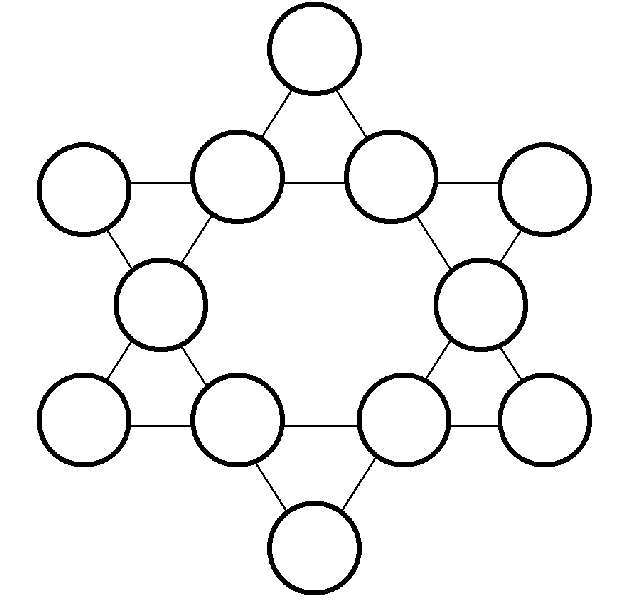

Magic Star
==========

There is this 6 pointed magic star, and there are numbers from 1 to 12.
The problem is to put those numbers in the star (they can't repeat), in a way that
each line has 4 numbers that sums 26.

Proposed solution
-----------------

- Time complexity: O(n^n)
- Space complexity: O(n)
Where n is the number of nodes of the star (12, for the problem).

The time complexity above is actually over-estimated.

The idea is to compute and print all possibilities.
It is possible to test the rules every time a new number is put at a node. This
reduces the time from minutes to seconds.

